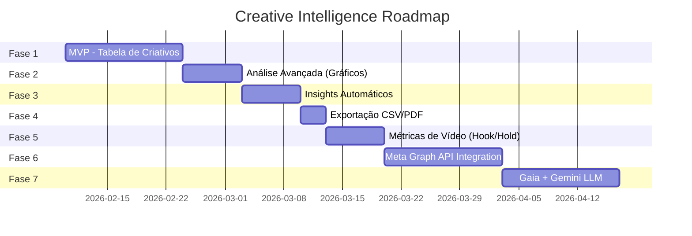

# Cronograma: Creative Intelligence Module

**Projeto:** DashAds Ulbra  
**Módulo:** Análise de Criativos com IA  
**Data de Início:** 10/02/2026  
**Duração Total:** 9 semanas  
**Squad:** DashAds Core

---

## 📅 Visão Geral do Cronograma

---

## 🗓️ Detalhamento por Sprint

### Sprint 1-2: Fase 1 - MVP (10/02 - 21/02)
**Objetivo:** Tabela funcional de criativos com filtros básicos

| Tarefa | Responsável | Dias |
|--------|-------------|------|
| Criar `vw_creative_performance` | @data-engineer (Flux) | 2 |
| Página `/creatives` com tabela | @dev (Dex) | 3 |
| Filtros (período, unidade, curso) | @dev (Dex) | 2 |
| KPIs principais (cards) | @ux-design-expert (Aura) | 1 |
| Ordenação por coluna | @dev (Dex) | 1 |
| Testes de integração | @qa (Quinn) | 1 |

**Entregável:** Dashboard básico de criativos funcionando.

---

### Sprint 3: Fase 2 - Análise Avançada (24/02 - 28/02)
**Objetivo:** Gráficos de performance e tendências

| Tarefa | Responsável | Dias |
|--------|-------------|------|
| Line chart (performance temporal) | @dev (Dex) + @ux (Aura) | 2 |
| Bar chart (Top 10 criativos) | @dev (Dex) | 1 |
| Pie chart (distribuição por tipo) | @dev (Dex) | 1 |
| Algoritmo de detecção de fadiga | @data-engineer (Flux) + @analyst (Adriel) | 1 |

**Entregável:** Visualizações de BI integradas.

---

### Sprint 4: Fase 3 - Insights Automáticos (03/03 - 07/03)
**Objetivo:** Cards de insights gerados por regras de negócio

| Tarefa | Responsável | Dias |
|--------|-------------|------|
| Lógica de geração de insights (SQL) | @data-engineer (Flux) | 2 |
| Componente `InsightCard` | @ux-design-expert (Aura) | 1 |
| Integração frontend | @dev (Dex) | 1 |
| Badges visuais na tabela (fadiga) | @dev (Dex) | 1 |

**Entregável:** Insights textuais automáticos no dashboard.

---

### Sprint 5 (Parcial): Fase 4 - Exportação (10/03 - 12/03)
**Objetivo:** Exportar dados para análise externa

| Tarefa | Responsável | Dias |
|--------|-------------|------|
| Exportar CSV | @dev (Dex) | 1 |
| Exportar PDF (relatório executivo) | @dev (Dex) + @ux (Aura) | 2 |

**Entregável:** Botões de exportação funcionais.

---

### Sprint 5-6: Fase 5 - Métricas de Vídeo (13/03 - 19/03)
**Objetivo:** Hook Rate, Hold Rate e CTA Click Rate

| Tarefa | Responsável | Dias |
|--------|-------------|------|
| Expandir `fact_creative_assets` | @data-engineer (Flux) | 1 |
| Edge Function `fetch-video-insights` | @devops (Gage) + @data-engineer (Flux) | 2 |
| Colunas Hook/Hold na tabela | @dev (Dex) | 1 |
| Gráfico de funil de retenção | @ux-design-expert (Aura) + @dev (Dex) | 1 |

**Entregável:** Métricas de vídeo integradas.

---

### Sprint 6-7: Fase 6 - Meta Graph API (20/03 - 02/04)
**Objetivo:** Enriquecer criativos com dados da Graph API

| Tarefa | Responsável | Dias |
|--------|-------------|------|
| Criar tabela `fact_creative_assets` | @data-engineer (Flux) | 1 |
| Configurar Meta Access Token (Vault) | @devops (Gage) | 1 |
| Edge Function `enrich-creative` | @devops (Gage) + @dev (Dex) | 3 |
| Cache de 7 dias (evitar rate limits) | @architect (Skye) + @data-engineer (Flux) | 1 |
| Exibir preview de imagem/vídeo | @dev (Dex) + @ux (Aura) | 2 |
| Modal de detalhes do criativo | @ux-design-expert (Aura) | 2 |

**Entregável:** Criativos enriquecidos com visual e copy.

---

### Sprint 8-9: Fase 7 - Gaia + Gemini LLM (03/04 - 16/04)
**Objetivo:** Análise profunda com IA

| Tarefa | Responsável | Dias |
|--------|-------------|------|
| Criar tabela `fact_creative_insights` | @data-engineer (Flux) | 1 |
| Configurar Gemini API Key (Vault) | @devops (Gage) | 1 |
| Edge Function `analyze-with-llm` | @devops (Gage) + @dev (Dex) | 3 |
| Implementar System Prompt (Gaia) | @pm (Morgan) + @analyst (Adriel) | 1 |
| Botão "Analisar com IA" | @dev (Dex) | 1 |
| Card de diagnóstico IA | @ux-design-expert (Aura) | 2 |
| Gerador de briefing automático | @dev (Dex) | 1 |
| Testes de ponta a ponta | @qa (Quinn) | 2 |

**Entregável:** Gaia operacional no produto.

---

## 🎯 Milestones

| Data | Milestone | Owner |
|------|-----------|-------|
| 21/02 | MVP Aprovado | @pm (Morgan) |
| 07/03 | Insights Automáticos Live | @analyst (Adriel) |
| 02/04 | Graph API Integrada | @architect (Skye) |
| 16/04 | **Gaia 1.0 em Produção** | @devops (Gage) |

---

## 📊 Alocação da Squad

| Membro | Fases de Maior Atuação |
|--------|------------------------|
| @data-engineer (Flux) | 1, 2, 3, 5, 6, 7 |
| @dev (Dex) | 1, 2, 3, 4, 5, 6, 7 |
| @ux-design-expert (Aura) | 1, 2, 4, 6, 7 |
| @analyst (Adriel) | 2, 3, 7 |
| @architect (Skye) | 6 |
| @devops (Gage) | 5, 6, 7 |
| @pm (Morgan) | 7 (System Prompt) |
| @qa (Quinn) | 1, 7 |
| @sm (River) | Todas (Coordenação) |

---

**Aprovação:** Gestor de Marketing + Equipe de Mídia  
**Próximo Passo:** Iniciar Sprint 1 em 10/02/2026

— Squad DashAds Core 🏗️⚡
