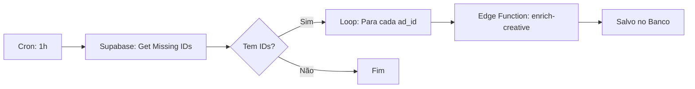

# Blueprint: Creative Assets ETL (n8n)

Este documento descreve como configurar o workflow no n8n para automatizar o enriquecimento de criativos no DashAds.

## Fluxo Lógico



## Passo a Passo na Configuração

### 1. Nodes Iniciais (Discovery)
- **Schedule Node:** Configure para rodar a cada 1 hora ou conforme sua necessidade.
- **Supabase Node (Execute RPC):**
    - **Function Name:** `get_missing_creatives`
    - **Parameters:** `{ "limit_count": 50 }`
    - *Isso garante que não estouraremos o rate limit da Meta processando tudo de uma vez.*

### 2. Node de Loop (Iterator)
- **Loop Over Items:** Conecte o output do Supabase para iterar sobre a lista de `ad_id`.

### 3. Node de Execução (Enrichment)
- **HTTP Request Node:**
    - **Method:** `POST`
    - **URL:** `https://[SEU-PROJETO].supabase.co/functions/v1/enrich-creative`
    - **Authentication:** Header `Authorization: Bearer [SERVICE_ROLE_KEY]`
    - **Body (JSON):** 
      ```json
      { "adId": "{{$json.ad_id}}" }
      ```

### 4. Vantagens desta Configuração
- **Proatividade:** O dashboard sempre terá imagens prontas.
- **Resiliência:** Se a Meta falhar em um ID, o loop continua nos outros.
- **Economia:** Evita chamadas redundantes da API por múltiplos usuários.

---
*Squad DashAds Core*
