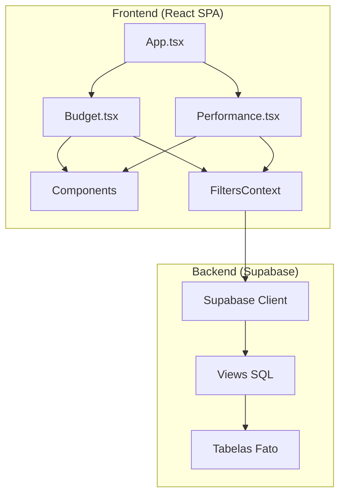

# DashAds ULBRA - Product Requirements Document (PRD)

**Versão:** 1.0  
**Data:** 26/01/2026  
**Autor:** Sistema de Documentação Automatizado  
**Projeto:** Dashboard de Controle de Budget e Performance de Mídia Digital  

---

## 📋 Sumário Executivo

O **DashAds ULBRA** é um dashboard de Business Intelligence para controle e monitoramento de campanhas de mídia digital da ULBRA (Universidade Luterana do Brasil). O sistema permite visualizar orçamentos planejados vs. realizados, métricas de performance (leads, CPL, CTR) e análise de pacing dinâmico para garantir execução otimizada do budget de marketing.

### Principais Funcionalidades
1. **Controle de Budget**: Comparação Budget Planejado vs. Gasto Realizado por período, unidade, curso e plataforma.
2. **Performance de Captação**: Análise de leads, CPL, investimento e eficiência de campanhas.
3. **Matriz de Investimento**: Visão hierárquica (EAD > Branding > Conversão) com drill-down.
4. **Pacing Dinâmico**: Cálculo de ritmo de gastos com tolerâncias que diminuem ao longo do mês.
5. **Filtros Avançados**: Por período, semana, unidade, curso e plataforma.

---

## 🏗️ Arquitetura do Sistema



### Stack Tecnológica

| Camada | Tecnologia | Versão |
|--------|------------|--------|
| **Frontend** | React + TypeScript | 18.3.1 / 5.8.3 |
| **Build Tool** | Vite | 5.4.19 |
| **Estilização** | Tailwind CSS | 3.4.17 |
| **Componentes UI** | shadcn/ui (Radix) | Latest |
| **Gráficos** | Recharts | 2.15.4 |
| **Estado Server** | TanStack React Query | 5.83.0 |
| **Roteamento** | React Router DOM | 6.30.1 |
| **Backend/DB** | Supabase (PostgreSQL) | 2.90.1 |
| **Datas** | date-fns | 3.6.0 |

---

## 📁 Estrutura de Diretórios

```
dashads-ulbra/
├── src/
│   ├── pages/                    # Páginas principais
│   │   ├── Budget.tsx            # Dashboard de Controle de Budget
│   │   ├── Performance.tsx       # Dashboard de Performance
│   │   ├── Index.tsx             # Redirect para /budget
│   │   └── NotFound.tsx          # Página 404
│   │
│   ├── components/
│   │   ├── app/                  # Layout e navegação
│   │   │   ├── AppLayout.tsx     # Layout principal com Sidebar
│   │   │   └── AppSidebar.tsx    # Menu lateral
│   │   │
│   │   ├── budget/               # Componentes do Budget
│   │   │   ├── DashboardFilterBar.tsx    # Barra de filtros
│   │   │   ├── KpiCard.tsx               # Card de KPI
│   │   │   ├── InvestmentTreeTable.tsx   # Matriz hierárquica
│   │   │   ├── FunnelStrategyChart.tsx   # Gráfico de funil
│   │   │   ├── PlatformDonutChart.tsx    # Donut por plataforma
│   │   │   ├── WeeklyComparisonChart.tsx # Comparativo semanal
│   │   │   ├── WeeklyDrawer.tsx          # Drawer de detalhe semanal
│   │   │   ├── InvestmentMatrix.tsx      # Matriz de investimento
│   │   │   ├── ChartTooltip.tsx          # Tooltip customizado
│   │   │   └── EmptyState.tsx            # Estado vazio
│   │   │
│   │   ├── performance/          # Componentes de Performance
│   │   │   ├── PerformanceFilterBar.tsx  # Filtros de performance
│   │   │   ├── PerformanceKpiGrid.tsx    # Grid de KPIs
│   │   │   ├── PerformanceCharts.tsx     # Gráficos (CPL, Leads)
│   │   │   └── PerformanceTable.tsx      # Tabela de dados
│   │   │
│   │   └── ui/                   # Componentes shadcn/ui
│   │       └── (50+ componentes)
│   │
│   ├── contexts/
│   │   └── filters-context.tsx   # Estado global de filtros
│   │
│   ├── integrations/
│   │   └── supabase/
│   │       ├── client.ts                    # Configuração Supabase
│   │       ├── budgetSchema.ts              # Resolver de colunas Budget
│   │       ├── performanceSchema.ts         # Resolver de colunas Performance
│   │       └── performanceMetricsSchema.ts  # Resolver de métricas
│   │
│   ├── lib/
│   │   ├── utils.ts              # Utilitários (cn, etc)
│   │   └── pacing-utils.ts       # Lógica de pacing dinâmico
│   │
│   └── hooks/
│       └── use-mobile.tsx        # Hook para detecção mobile
│
├── sql/
│   └── update_vw_performance_diaria.sql  # Script da View
│
├── docs/
│   └── PRD.md                    # Este documento
│
└── package.json
```

---

## 🗄️ Modelagem de Dados (Backend)

### Tabelas do Sistema (Supabase/PostgreSQL)

#### Tabelas Dimensionais e Auxiliares

| Tabela | Descrição |
|--------|-----------|
| `units` | Unidades de negócio (ex: Ulbra Canoas, EAD). |
| `courses` | Cursos ofertados (ex: Medicina, Direito). |
| `dim_campaign_mapping` | Regras manuais para vincular campanhas a Unidades/Cursos. |
| `tracking_scripts` | Scripts de rastreamento (GTM, Pixels) gerenciáveis via painel. |
| `profiles` | Perfis de usuários do sistema (vinculado ao `auth.users`). |
| `sys_integration_logs` | Logs brutos de execução dos workflows de ETL/Integração. |

#### Tabelas Fato

**`fact_ads_performance_daily`**
Tabela principal com dados diários de performance de anúncios.

| Coluna | Tipo | Descrição |
|--------|------|-----------|
| `date` | DATE | Data de referência |
| `campaign_name` | VARCHAR | Nome da campanha |
| `account_name` | VARCHAR | Nome da conta de anúncios |
| `platform` | VARCHAR | Plataforma (META, GOOGLE) |
| `spend` | DECIMAL | Gasto do dia |
| `conversions` | INTEGER | Conversões (Leads) |

**`fact_ads_budget`**
Tabela de orçamento planejado mensal.

| Coluna | Tipo | Descrição |
|--------|------|-----------|
| `month` | DATE | Mês de referência |
| `budget` | DECIMAL | Orçamento planejado |
| `platform` | VARCHAR | META / GOOGLE |
| `campaign_name` | VARCHAR | Unidade/Campanha |

---

### Views SQL

#### Views de Log e Auditoria

| View | Função | Arquivo SQL |
|------|--------|-------------|
| `vw_logs_detalhados` | Exibe logs com horário ajustado (Brasília) e nomes legíveis. | `create_vw_logs_detalhados.sql` |
| `vw_logs_resumidos` | Agrupa logs por hora para mostrar status macro (Sucesso, Erro, Timeout). | `create_vw_logs_resumidos.sql` |
| `vw_auditoria_diaria` | Resumo financeiro diário por conta auditoria com NFs. | `create_vw_auditoria_diaria.sql` |
| `vw_campaign_mapping_readable` | Facilita a leitura do mapeamento de campanhas trazendo nomes de Units/Courses. | `vw_campaign_mapping_readable.sql` |

#### Views de Negócio

**`vw_performance_diaria2`**
View que classifica automaticamente campanhas em Unidade e Curso baseado em regras de negócio.

```sql
CREATE OR REPLACE VIEW vw_performance_diaria2 AS
-- (Trecho simplificado da lógica)
SELECT 
    date::date as data_referencia, 
    platform,
    -- Lógica de Unidade (ex: '%EAD%' -> 'EAD')
    CASE ... END as unidade,
    -- Lógica de Curso (ex: '%Medicina%' -> 'Medicina')
    CASE ... END as curso,
    spend,
    conversions as leads
FROM fact_ads_performance_daily
WHERE campaign_name NOT ILIKE '%Ultec%' -- Exclui Ultec
```

**`vw_dashboard_semanal_detalhado2`**
View que agrega dados por semana para o dashboard de Budget.

| Coluna | Descrição |
|--------|-----------|
| `semana_label` | Label (ex: "19 a 25 jan") |
| `unidade` | Unidade classificada |
| `orcamento_semanal` | Budget planejado da semana |
| `gasto_real` | Gasto realizado |
| `percentual_consumido` | % de utilização |

---

## 🔌 Integração Supabase

### Configuração do Cliente

```typescript
// src/integrations/supabase/client.ts

import { createClient, type SupabaseClient } from "@supabase/supabase-js";

// Variáveis de ambiente (Vite)
// VITE_SUPABASE_URL=https://your-project.supabase.co
// VITE_SUPABASE_ANON_KEY=your-anon-key

export function getSupabaseClient(): SupabaseClient | null {
  const url = import.meta.env.VITE_SUPABASE_URL;
  const anonKey = import.meta.env.VITE_SUPABASE_ANON_KEY;
  
  if (!url || !anonKey) return null;
  
  return createClient(url, anonKey);
}
```

### Schema Resolvers (Detecção Automática de Colunas)

O sistema utiliza resolvers que detectam automaticamente os nomes das colunas nas tabelas, permitindo flexibilidade para diferentes configurações de banco:

```typescript
// src/integrations/supabase/budgetSchema.ts

export async function resolveBudgetColumns(client: SupabaseClient): Promise<BudgetColumns> {
  // Tenta encontrar a coluna de mês
  const monthCol = await firstWorkingColumn(client, [
    "month", "ref_month", "competence", "competencia", "date", "dt", "data"
  ]);
  
  // Tenta encontrar a coluna de budget
  const plannedCol = await firstWorkingColumn(client, [
    "budget", "planned_budget", "budget_planned", "planned", "amount", "value"
  ]);
  
  // Colunas opcionais
  const platformCol = await firstOptionalWorkingColumn(client, ["platform", "channel", "media"]);
  const unitCol = await firstOptionalWorkingColumn(client, ["campaign_name", "business_unit", "unidade"]);
  
  return { monthCol, plannedCol, platformCol, unitCol, funnelCol, locationCol };
}
```

---

## 📊 Páginas e Componentes

### 1. Budget Page (`/budget`)

#### Visão Geral
Dashboard principal de controle orçamentário com visualização de KPIs, gráficos e matriz hierárquica.

#### KPIs Exibidos

| KPI | Fórmula | Descrição |
|-----|---------|-----------|
| **Budget Total** | `SUM(orcamento_semanal)` | Orçamento planejado do período |
| **Gasto Realizado** | `SUM(gasto_real)` | Valor executado até hoje |
| **Pacing Global** | `Gasto / Budget × 100` | % de utilização do budget |
| **Variância (R$)** | `Budget - Forecast` | Sobra/falta projetada |
| **Forecast** | `(Gasto / diasPassados) × diasTotais` | Projeção de fechamento |
| **Leads Totais** | `SUM(leads)` excluindo Branding | Volume de performance |
| **CPL Médio** | `Gasto / Leads` (sem Branding) | Custo por Lead |

#### Gráficos

1. **Progresso por Unidade** (BarChart): Top 12 unidades por budget/spend
2. **Pacing Semanal Acumulado** (ComposedChart): Linha ideal vs. real
3. **Investimento por Estratégia** (PieChart): EAD / Branding / Conversão
4. **Investimento por Plataforma** (DonutChart): META vs. GOOGLE

#### Matriz de Investimento (InvestmentTreeTable)

Visão hierárquica em árvore com 3 grupos principais:

```
1. EAD
   ├── META
   └── GOOGLE

2. Branding
   ├── META
   └── GOOGLE

3. Mkt de Conversão
   ├── 3.1 Medicina
   │   ├── META
   │   └── GOOGLE
   └── 3.2 Cursos
       ├── Ulbra Canoas
       │   ├── Direito
       │   │   ├── META
       │   │   └── GOOGLE
       │   ├── Odonto
       │   │   └── ...
       │   └── ...
       └── Ulbra Torres
           └── ...
```

**Lógica de Classificação:**

```typescript
// Ordem de prioridade:
// 1. EAD: unit/course contém "EAD"
// 2. Branding: funnel_stage = "branding" OU unit contém "branding/institucional"
// 3. Conversão: Todo o resto

const isEad = unit.includes("ead") || course.includes("ead");
const isBranding = funnel === "branding" || unit.includes("branding") || unit.includes("institucional");

if (isEad) → Grupo 1
else if (isBranding) → Grupo 2
else → Grupo 3
```

---

### 2. Performance Page (`/performance`)

#### Visão Geral
Dashboard de análise de performance de captação de leads.

#### KPIs Exibidos

| KPI | Descrição |
|-----|-----------|
| **Investimento** | Total gasto no período |
| **Leads** | Total de conversões |
| **CPL** | Custo por Lead médio |
| **CTR** | Taxa de cliques |
| **Cliques** | Total de cliques |
| **Impressões** | Total de impressões |

#### Filtro "Ocultar Branding"

Quando ativo, exclui campanhas classificadas como Branding dos KPIs e gráficos:

```typescript
const activeRows = rows.filter((r) => {
  if (!filters.hideBranding) return true;
  
  const u = (r.unidade || "").toLowerCase();
  const c = (r.curso || "").toLowerCase();
  const f = (r.funnel_stage || "").toLowerCase();
  
  // EAD tem prioridade (mantém mesmo se tiver "branding" no nome)
  const isEad = u.includes("ead") || c.includes("ead");
  const isBranding = f === "branding" || u.includes("branding") || u.includes("institucional");
  
  if (isEad) return true;  // Mantém EAD
  return !isBranding;       // Remove Branding puro
});
```

---

## 🎛️ Sistema de Filtros

### FiltersContext

Estado global gerenciado via React Context:

```typescript
// src/contexts/filters-context.tsx

export type FiltersState = {
  month: Date;                    // Mês base
  dateRange: DateRange | undefined; // Range selecionado
  businessUnit: string | null;    // Unidade filtrada
  course: string | null;          // Curso filtrado
  platform: string | null;        // Plataforma (META/GOOGLE)
  week: string | null;            // Semana específica (ISO date)
  excludeEad: boolean;            // Excluir EAD dos cálculos
  hideBranding: boolean;          // Ocultar Branding (default: true)
};
```

### Comportamento dos Filtros

| Filtro | Comportamento |
|--------|---------------|
| **Período** | DateRangePicker que define `dateRange.from` e `dateRange.to` |
| **Semana** | Ao selecionar, ajusta `dateRange` para seg-dom da semana |
| **Unidade** | Filtra por `unidade` na query; limpa `course` ao mudar |
| **Curso** | Filtra por `curso`; só habilitado quando `businessUnit` está definido |
| **Plataforma** | Filtra por `platform` (META/GOOGLE) |
| **Ocultar Branding** | Filtra rows no frontend antes de calcular KPIs |

---

## 📈 Lógica de Pacing Dinâmico

### Conceito

O pacing é calculado dinamicamente com base no dia do mês. A tolerância diminui conforme o mês avança:

- **Início do mês:** ±20% de tolerância
- **Meio do mês:** ±10% de tolerância
- **Final do mês:** ±2% de tolerância

### Implementação

```typescript
// src/lib/pacing-utils.ts

export function getDynamicThresholds(currentDate: Date, monthDate: Date): DynamicThresholds {
  const totalDays = endOfMonth(monthDate).getDate();
  const currentDay = currentDate.getDate();
  
  const monthProgress = currentDay / totalDays; // 0.0 a 1.0
  const daysRemaining = totalDays - currentDay;
  
  // Tolerância decresce linearmente
  const baseTolerance = 0.20; // 20% no início
  const progressFactor = daysRemaining / totalDays;
  const tolerance = Math.max(baseTolerance * progressFactor, 0.02); // Mínimo 2%
  
  return {
    expectedProgress: monthProgress,
    idealMin: Math.max(0, monthProgress - tolerance),
    idealMax: Math.min(1, monthProgress + tolerance),
    warningMin: Math.max(0, monthProgress - (tolerance * 1.5)),
    warningMax: Math.min(1, monthProgress + (tolerance * 1.5)),
    tolerance,
  };
}

export function getDynamicPacingStatus(utilization: number, currentDate: Date, monthDate: Date): PacingStatus {
  const thresholds = getDynamicThresholds(currentDate, monthDate);
  
  if (utilization < thresholds.warningMin || utilization > thresholds.warningMax) {
    return "error";    // Crítico (vermelho)
  }
  if (utilization < thresholds.idealMin || utilization > thresholds.idealMax) {
    return "warning";  // Atenção (amarelo)
  }
  return "success";    // No Ritmo (verde)
}
```

### Status de Pacing

| Status | Cor | Significado |
|--------|-----|-------------|
| `success` | 🟢 Verde | Dentro da faixa ideal |
| `warning` | 🟡 Amarelo | Próximo aos limites |
| `error` | 🔴 Vermelho | Fora da margem aceitável |

---

## 🚀 Deploy e Configuração

### Variáveis de Ambiente

```bash
# .env.local (não commitado)
VITE_SUPABASE_URL=https://your-project.supabase.co
VITE_SUPABASE_ANON_KEY=your-anon-key-here
```

### Docker Build

```bash
docker build \
  --build-arg VITE_SUPABASE_URL=https://your-project.supabase.co \
  --build-arg VITE_SUPABASE_ANON_KEY=your-anon-key \
  -t dashads-ulbra .
```

### Scripts NPM

| Comando | Descrição |
|---------|-----------|
| `npm run dev` | Servidor de desenvolvimento (Vite) |
| `npm run build` | Build de produção |
| `npm run preview` | Preview do build |
| `npm run lint` | Linting ESLint |
| `npm run test` | Executar testes (Vitest) |

---

## 📝 Regras de Negócio Importantes

### 1. Exclusão de Campanhas

- **Ultec**: Sempre excluído dos cálculos (filtrado na View SQL)
- **Branding**: Excluído opcionalmente via toggle "Ocultar Branding"

### 2. Prioridade de Classificação

```
EAD > Branding > Conversão
```

Se uma campanha tem "EAD" no nome, ela é classificada como EAD mesmo que tenha também "Branding".

### 3. CPL Sem Branding

O CPL exibido nos KPIs é calculado **excluindo** o investimento de Branding:

```typescript
const spendWithoutBranding = totalSpend - brandingSpend;
const cplWithoutBranding = spendWithoutBranding / performanceLeads;
```

### 4. Semana ISO (Segunda a Domingo)

As semanas são definidas de segunda a domingo:
```typescript
{ weekStartsOn: 1 } // Segunda-feira
```

---

## 🔧 Manutenção e Extensões

### Adicionar Nova Unidade

1. Editar View SQL `vw_performance_diaria2`:
   ```sql
   WHEN campaign_name ILIKE '%NovaUnidade%' THEN 'Ulbra Nova Unidade'
   ```

2. Recriar a View no Supabase:
   ```sql
   DROP VIEW IF EXISTS vw_performance_diaria2;
   CREATE OR REPLACE VIEW vw_performance_diaria2 AS ...
   ```

### Adicionar Novo Curso

1. Editar o CASE de curso na View:
   ```sql
   WHEN campaign_name ILIKE '%NovoCurso%' THEN 'Novo Curso'
   ```

### Adicionar Nova Plataforma

1. Inserir dados na `fact_ads_performance_daily` com a nova plataforma
2. O sistema detectará automaticamente via schema resolver

---

## 📊 Consultas SQL Úteis

### Verificar Budget de uma Semana

```sql
SELECT 
  sum(orcamento_semanal) as budget_planejado,
  sum(gasto_real) as gasto_realizado
FROM vw_dashboard_semanal_detalhado2
WHERE data_inicio_semana = '2026-01-19';
```

### Budget por Unidade

```sql
SELECT 
  unidade,
  sum(orcamento_semanal) as budget,
  sum(gasto_real) as gasto
FROM vw_dashboard_semanal_detalhado2
WHERE data_inicio_semana >= '2026-01-01'
  AND data_inicio_semana <= '2026-01-31'
GROUP BY unidade
ORDER BY budget DESC;
```

### Performance por Plataforma

```sql
SELECT 
  platform,
  sum(investimento) as gasto,
  sum(leads) as leads,
  ROUND(sum(investimento) / NULLIF(sum(leads), 0), 2) as cpl
FROM vw_performance_diaria2
WHERE data_referencia >= '2026-01-01'
  AND data_referencia <= '2026-01-31'
GROUP BY platform;
```

---

## 📞 Suporte

Para dúvidas técnicas ou manutenção, consulte:
- Código fonte: `https://github.com/marcosrodsa/dashads-ulbra`
- Supabase Dashboard: `https://app.supabase.com`

---

**Documento gerado em:** 26/01/2026  
**Próxima revisão:** A cada release major
