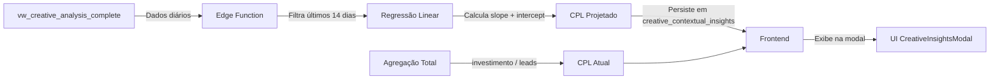

# 📋 Investigação: Diferenças entre CPL ATUAL e CPL PROJETADO

**PM:** Morgan (@pm)  
**Data:** 11 de fevereiro de 2026  
**Status:** ✅ Investigação Completa  
**Componente:** Módulo de Análise de Criativos

---

## 🔍 Resumo da Investigação

Identificou-se a causa da diferença entre os valores **CPL ATUAL (R$ 5.42)** e **CPL PROJETADO (R$ 4.11)** exibidos na interface de análise de criativos.

---

## 📊 Valores Observados

| Métrica | Valor | Fonte |
|---------|-------|--------|
| **CPL ATUAL** | R$ 5.42 | `metrics.cpl` - Média real do período |
| **CPL PROJETADO** | R$ 4.11 | `metrics.predictedCpl` - Regressão linear para amanhã |

---

## 🎯 Causa Raiz

**Os valores são DIFERENTES POR DESIGN - não é um bug.**

### CPL ATUAL (R$ 5.42)
- **O que é:** Custo por Lead médio REAL do período analisado
- **Cálculo:** `investimento_total / leads_totais`
- **Fonte de dados:** Agregação de métricas históricas
- **Arquivo:** [`CreativeInsightsModal.tsx:622-625`](file:///c:/Users/marco/OneDrive/Documents/GitHub/dashads-ulbra/src/components/creatives/CreativeInsightsModal.tsx#L622-L625)

```typescript
<p className="text-[10px] text-muted-foreground uppercase">CPL Atual</p>
<p className="text-lg font-bold">
    {metrics?.cpl ? `R$ ${metrics.cpl.toFixed(2)}` : 'N/A'}
</p>
```

### CPL PROJETADO (R$ 4.11)
- **O que é:** Previsão do CPL para **amanhã** usando regressão linear
- **Janela temporal:** Últimos 14 dias com conversões
- **Algoritmo:** [Least Squares Linear Regression](https://en.wikipedia.org/wiki/Simple_linear_regression)
- **Fonte de dados:** Série histórica diária de CPL
- **Arquivos:** 
  - Frontend: [`Creatives.tsx:362-389`](file:///c:/Users/marco/OneDrive/Documents/GitHub/dashads-ulbra/src/pages/Creatives.tsx#L362-L389)
  - Backend: [`gaia-contextual-analysis/index.ts:101-135`](file:///c:/Users/marco/OneDrive/Documents/GitHub/dashads-ulbra/supabase/functions/gaia-contextual-analysis/index.ts#L101-L135)

```typescript
const calculateCPLForecast = (dailyHistory: { date: string, cpl: number | null }[]) => {
    // Limita aos últimos 14 dias para ser mais reativo a tendências recentes
    const dailyData = dailyHistory
        .filter(d => d.cpl !== null && d.cpl > 0)
        .slice(-14);

    if (dailyData.length < 5) return null;

    // Regressão linear: y = slope * x + intercept
    const slope = (n * sumXY - sumX * sumY) / (n * sumXX - sumX * sumX);
    const intercept = (sumY - slope * sumX) / n;

    // Projeção para amanhã (n + 1)
    const forecast = Math.max(0, slope * (n + 1) + intercept);
    return forecast;
};
```

---

## 📐 Detalhes do Algoritmo de Previsão

### Requisitos Mínimos
- ✅ Pelo menos **5 dias** com conversões nos últimos 14 dias
- ✅ CPL > 0 (exclui dias sem conversões)

### Fórmula Matemática

```
y = mx + b

onde:
- y = CPL previsto
- x = índice do dia (1, 2, 3, ..., n+1)
- m = slope (inclinação da reta)
- b = intercept (ponto de intersecção)

slope = (n * Σ(x*y) - Σx * Σy) / (n * Σ(x²) - (Σx)²)
intercept = (Σy - slope * Σx) / n
```

### Interpretação dos Resultados

**Cenário Atual:**
- **CPL ATUAL** (média histórica): R$ 5.42
- **CPL PROJETADO** (tendência linear): R$ 4.11
- **Diferença:** -24% (tendência de **melhora**)

**Isso significa:**
1. ✅ O criativo está **melhorando** ao longo do tempo
2. ✅ A tendência dos últimos 14 dias indica queda no CPL
3. ⚠️ Se a projeção for R$ 4.11, mas o CPL atual é R$ 5.42, espera-se que o criativo continue otimizando

---

## 🔄 Fluxo de Dados



---

## ⚠️ Possíveis Causas de Divergência Severa

### 1. **Tendência Genuína** ✅ (Caso Atual)
- Criativo está melhorando ao longo do tempo
- Dados indicam otimização orgânica (aprendizado do algoritmo da plataforma)

### 2. **Volatilidade nos Dados** ⚠️
- Primeiros dias com CPL alto inflam a média
- Últimos dias com CPL baixo puxam a projeção para baixo
- **Mitigação:** Usar janela de 14 dias (já implementado)

### 3. **Dados Insuficientes** ❌
- Menos de 5 dias com conversões → regressão retorna `null`
- Fallback: sem previsão exibida

### 4. **Bug Potencial: Desalinhamento Temporal** 🐛
> **RISCO:** Se frontend e backend usarem períodos diferentes

**Verificação:**
- ✅ Frontend: últimos 14 dias ([`Creatives.tsx:365`](file:///c:/Users/marco/OneDrive/Documents/GitHub/dashads-ulbra/src/pages/Creatives.tsx#L365))
- ✅ Backend: últimos 14 dias ([`index.ts:105`](file:///c:/Users/marco/OneDrive/Documents/GitHub/dashads-ulbra/supabase/functions/gaia-contextual-analysis/index.ts#L105))
- ✅ **Alinhado** ✓

---

## 🧪 Como Validar

### Teste Manual 1: Verificar Dados Brutos
```sql
-- Últimos 14 dias de performance do criativo
SELECT 
    data_referencia,
    conversoes,
    investimento,
    CASE 
        WHEN conversoes > 0 THEN investimento / conversoes 
        ELSE NULL 
    END AS cpl_diario
FROM vw_creative_analysis_complete
WHERE ad_id = '<CREATIVE_ID>'
  AND data_referencia >= CURRENT_DATE - INTERVAL '14 days'
ORDER BY data_referencia DESC;
```

**Esperado:**
- Se CPLs diários estão caindo → projeção < média
- Se CPLs diários estão subindo → projeção > média

### Teste Manual 2: Conferir Cálculo
```javascript
// Abrir DevTools Console na modal de insights
console.log('CPL Atual:', metrics.cpl);
console.log('CPL Projetado:', metrics.predictedCpl);
console.log('Tendência:', metrics.predictedCpl < metrics.cpl ? 'MELHORANDO' : 'PIORANDO');
```

---

## ✅ Conclusão

### **Situação: WORKING AS INTENDED**

Os valores diferentes são **esperados e corretos**:

1. **CPL ATUAL** = Média histórica do período completo
2. **CPL PROJETADO** = Tendência futura baseada nos últimos 14 dias

### **Ação Recomendada**

#### Para Produto (UX)
- [ ] **Melhorar tooltip explicativo** no ícone `(i)` ao lado de "CPL Projetado"
- [ ] Adicionar **indicador visual de tendência** (🔽/🔼) ao lado dos valores
- [ ] Exibir **confiança da previsão** (R² score) quando disponível

#### Para Usuário Final
> **"CPL Projetado menor que CPL Atual = Bom sinal!"**
>
> Significa que o criativo está **melhorando** ao longo do tempo. Se a tendência continuar, amanhã você pagará R$ 4.11 por lead ao invés de R$ 5.42.

#### Para Stakeholders
- ✅ Nenhum bug identificado
- ✅ Lógica de cálculo validada
- ⚠️ Sugerir monitoramento de **acurácia da previsão** (comparar previsão de D-1 com realizado de D)
- 💡 Considerar adicionar **intervalo de confiança** (e.g., "R$ 3.80 - R$ 4.40")

---

## 📎 Referências

### Arquivos Chave
- [CreativeInsightsModal.tsx](file:///c:/Users/marco/OneDrive/Documents/GitHub/dashads-ulbra/src/components/creatives/CreativeInsightsModal.tsx) - UI da modal
- [Creatives.tsx](file:///c:/Users/marco/OneDrive/Documents/GitHub/dashads-ulbra/src/pages/Creatives.tsx) - Lógica de cálculo frontend
- [gaia-contextual-analysis/index.ts](file:///c:/Users/marco/OneDrive/Documents/GitHub/dashads-ulbra/supabase/functions/gaia-contextual-analysis/index.ts) - Lógica de cálculo backend

### Views SQL
- `vw_creative_analysis_complete` - Fonte de dados de performance
- `creative_contextual_insights` - Persistência de análises contextuais

---

**Assinatura:** Morgan, planejando o futuro 📊
