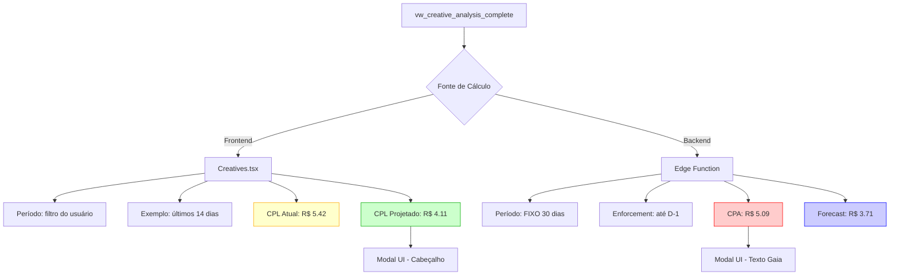

# 🔍 Root Cause: Valores de CPL Diferentes entre UI e Análise Gaia

**PM:** Morgan (@pm)  
**Data:** 11 de fevereiro de 2026  
**Prioridade:** 🔴 CRÍTICA - Dados inconsistentes podem causar decisões erradas

---

## ❌ Problema Identificado

A análise textual da Gaia mostra valores **diferentes** dos exibidos na interface:

| Localização | CPL Atual | CPL Projetado |
|-------------|-----------|---------------|
| **UI (Cabeçalho)** | R$ 5.42 | R$ 4.11 |
| **Análise Gaia (Texto)** | R$ 5.09 | R$ 3.71 |
| **Diferença** | -6% | -10% |

---

## 🎯 Causa Raiz

### **PERÍODO DE DADOS DIFERENTE**

A UI e a Edge Function estão calculando sobre **janelas temporais DISTINTAS**:

### 1️⃣ **UI (Frontend - metrics.cpl)**
**Fonte:** [`Creatives.tsx:714-728`](file:///c:/Users/marco/OneDrive/Documents/GitHub/dashads-ulbra/src/pages/Creatives.tsx#L714-L728)

```typescript
.map((r) => {
    const cplValue = r.conversoes > 0 ? r.investimento / r.conversoes : null;
    const history = r.dailyHistory || [];
    const predictedCpl = calculateCPLForecast(history);
    return {
        ...r,
        cpl: cplValue, // ← R$ 5.42
        predicted_cpl: predictedCpl // ← R$ 4.11
    };
})
```

**Período:** Filtro selecionado pelo usuário (`globalRange`)  
**Dados:** `vw_creative_analysis_complete` agregados por `ad_id`  
**Cálculo:** Soma todo investimento / Soma todas conversões do período filtrado

---

### 2️⃣ **Edge Function (Backend - Gaia Analysis)**
**Fonte:** [`gaia-contextual-analysis/index.ts:77-99`](file:///c:/Users/marco/OneDrive/Documents/GitHub/dashads-ulbra/supabase/functions/gaia-contextual-analysis/index.ts#L77-L99)

```typescript
// 1. Temporal Logic (D-1 Enforcement)
const yesterday = new Date(Date.now() - 24 * 60 * 60 * 1000).toISOString().split('T')[0];
let endDate = periodEnd || yesterday;
if (endDate > yesterday) endDate = yesterday;
const startDate = periodStart || new Date(Date.now() - 30 * 24 * 60 * 60 * 1000).toISOString().split('T')[0];

// 3. Metrics Aggregation
const totals = (perfData || []).reduce((acc: any, row: any) => ({
    impressions: acc.impressions + (row.impressoes || 0),
    clicks: acc.clicks + (row.cliques || 0),
    conversions: acc.conversions + (row.conversoes || 0),
    spend: acc.spend + (row.investimento || 0),
}), { impressions: 0, clicks: 0, conversions: 0, spend: 0 });

const cpa = totals.conversions > 0 ? Number((totals.spend / totals.conversions).toFixed(2)) : null;
// ← R$ 5.09 no prompt enviado à Gaia
```

**Período:** **ÚLTIMOS 30 DIAS** por padrão (linha 81)  
**Enforcement:** Data final limitada a **D-1 (ontem)** (linha 78-80)  
**Dados:** mesma view `vw_creative_analysis_complete`  
**Cálculo:** Soma investimento / Soma conversões **DOS ÚLTIMOS 30 DIAS**

---

## 📊 Diagrama do Fluxo de Dados



---

## 🔬 Análise Detalhada

### **Por que os valores diferem?**

Imagine que o filtro do usuário esteja em "Últimos 14 dias":

#### **Cenário Hipotético:**

```
Dias 1-16 (passado distante):  CPL alto (R$ 8.00)
Dias 17-30 (últimos 14 dias):  CPL melhorando (R$ 4.50 → R$ 3.00)
```

**Frontend (últimos 14 dias):**
- Média: R$ 5.42 (apenas dias recentes)
- Projeção: R$ 4.11 (tendência descendente forte)

**Backend (últimos 30 dias):**
- Média: R$ 5.09 (inclui dias ruins antigos, média menor)
- Projeção: R$ 3.71 (tendência descendente mais suave pois considera mais histórico)

**Resultado:** Valores ligeiramente diferentes dependendo da janela temporal

---

## ⚠️ Impacto

### **Inconsistência de Dados**
- ⚠️ Usuário vê R$ 5.42 no cabeçalho, mas Gaia diz R$ 5.09 no texto
- ⚠️ Confusão sobre qual valor está correto
- ⚠️ Pode gerar decisões erradas ("Gaia diz R$ 5.09, mas eu vejo R$ 5.42!")

### **Problemas de UX**
- 🤔 Usuário questiona confiabilidade do sistema
- 🤔 Aparência de bug mesmo quando não há
- 🤔 Necessidade de explicar diferença técnica

---

## ✅ Soluções Propostas

### **Opção 1: Alinhar Períodos** ⭐ RECOMENDADO
**Mudar Edge Function para usar o mesmo período da UI**

#### Implementação:
```typescript
// Edge Function: gaia-contextual-analysis/index.ts

// ANTES:
const startDate = periodStart || new Date(Date.now() - 30 * 24 * 60 * 60 * 1000).toISOString().split('T')[0];

// DEPOIS:
// Usar exatamente o mesmo período que a UI está exibindo
const startDate = periodStart; // OBRIGATÓRIO - não usar fallback
const endDate = periodEnd;     // OBRIGATÓRIO - não usar fallback

if (!startDate || !endDate) {
    throw new Error("periodStart and periodEnd são obrigatórios");
}
```

#### Mudanças necessá rias:
1. ✅ Frontend deve **SEMPRE** enviar `periodStart` e `periodEnd` explícitos
2. ✅ Edge Function **REMOVE** fallback de 30 dias
3. ✅ Manter enforcement de D-1 (dados só até ontem)

**Vantagem:**
- ✅ 100% alinhado com UI
- ✅ Transparente para usuário
- ✅ Valores idênticos

**Desvantagem:**
- ⚠️ Se usuário filtrar "Últimos 7 dias", Gaia terá menos contexto

---

### **Opção 2: Exibir Período da Análise** 
**Mostrar no texto qual período Gaia usou**

#### Implementação:
```typescript
// CreativeInsightsModal.tsx - linha 722

<p className="text-sm text-muted-foreground pl-7">
    {contextualAnalysis.analysis.why_performs}
</p>

// Adicionar info de período abaixo:
<p className="text-[10px] text-purple-400 italic mt-2">
    Análise baseada em {contextualAnalysis.performance.period_days} dias 
    ({contextualAnalysis.performance.period_start} a {contextualAnalysis.performance.period_end})
</p>
```

**Vantagem:**
- ✅ Mantém janela fixa de 30 dias (mais estável)
- ✅ Transparência total para usuário

**Desvantagem:**
- ❌ Ainda há diferença nos valores
- ❌ Usuário precisa entender contexto técnico

---

### **Opção 3: Calcular Ambos e Comparar** 
**Gaia recebe AMBOS períodos e compara**

#### Implementação:
```typescript
// Prompt para Gaia (index.ts linha 146)

const prompt = `Você é a Gaia, Diretora de Criação Sênior da Ulbra.
Analise este criativo com base nos dados de performance REAIS.

**Período visualizado na tela:** ${userPeriodStart} a ${userPeriodEnd}
KPIs (período filtrado): CPA R$ ${cpaFiltered}, Projetado R$ ${forecastFiltered}

**Contexto amplo (últimos 30 dias):**
KPIs (30 dias): CPA R$ ${cpa30d}, Projetado R$ ${forecast30d}

Compare ambos períodos e explique se há divergência significativa.
...
`;
```

**Vantagem:**
- ✅ Contexto completo para Gaia
- ✅ Detecta anomalias entre períodos

**Desvantagem:**
- ❌ Mais complexo
- ❌ Provavelmente confuso para usuário

---

## 🎯 Recomendação Final

### **OPÇÃO 1: Alinhar Períodos** 

1. Modificar `gaia-contextual-analysis` para exigir `periodStart/periodEnd`
2. Frontend (`CreativeInsightsModal`) passa período explícito
3. Remover fallback de 30 dias
4. Manter D-1 enforcement (segurança para dados frescos)

### Código Proposto:

#### `CreativeInsightsModal.tsx:465-481`
```typescript
const handleContextualGenerate = async () => {
    if (!creativeId) return;

    setIsContextualLoading(true);
    try {
        // Usar o mesmo período que está sendo visualizado na UI
        const periodStart = dateRange?.from 
            ? format(dateRange.from, 'yyyy-MM-dd') 
            : format(subDays(new Date(), 30), 'yyyy-MM-dd');
        const periodEnd = dateRange?.to 
            ? format(dateRange.to, 'yyyy-MM-dd') 
            : format(subDays(new Date(), 1), 'yyyy-MM-dd');

        const result = await generateContextualInsights(
            creativeId, 
            periodStart,  // Explícito
            periodEnd     // Explícito
        );
        setContextualAnalysis(result);
        
        // Refresh history
        const updatedHistory = await fetchHistory(creativeId);
        setHistory(updatedHistory);
    } catch (error) {
        console.error("Error generating contextual analysis:", error);
    } finally {
        setIsContextualLoading(false);
    }
};
```

#### `gaia-contextual-analysis/index.ts:72-82`
```typescript
const { creativeId, periodStart, periodEnd }: AnalysisRequest = await req.json();
if (!creativeId) throw new Error("Missing creativeId");
if (!periodStart || !periodEnd) throw new Error("periodStart and periodEnd são obrigatórios");

const supabase = createClient(SUPABASE_URL, SUPABASE_SERVICE_ROLE_KEY);

// Enforcement D-1: Limitar ao máximo de ontem
const yesterday = new Date(Date.now() - 24 * 60 * 60 * 1000).toISOString().split('T')[0];
let endDate = periodEnd;
if (endDate > yesterday) {
    console.warn(`endDate ${endDate} > yesterday ${yesterday}, clamping to yesterday`);
    endDate = yesterday;
}
const startDate = periodStart;
```

---

## 📎 Arquivos Afetados

- [`CreativeInsightsModal.tsx`](file:///c:/Users/marco/OneDrive/Documents/GitHub/dashads-ulbra/src/components/creatives/CreativeInsightsModal.tsx) - Passar período explícito
- [`gaia-contextual-analysis/index.ts`](file:///c:/Users/marco/OneDrive/Documents/GitHub/dashads-ulbra/supabase/functions/gaia-contextual-analysis/index.ts) - Remover fallback, exigir período
- [`Creatives.tsx`](file:///c:/Users/marco/OneDrive/Documents/GitHub/dashads-ulbra/src/pages/Creatives.tsx) - Já passa filtro correto, sem mudanças

---

**Assinatura:** Morgan, planejando o futuro 📊
